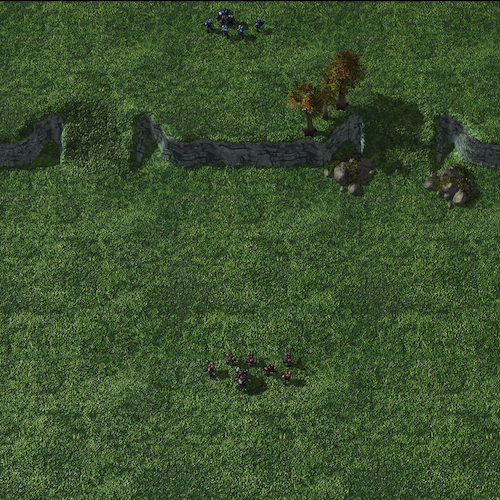
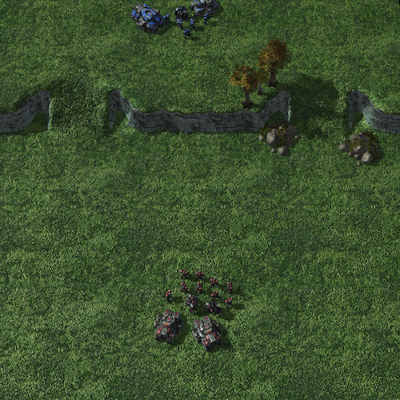
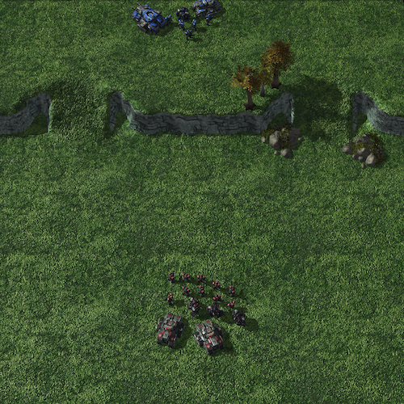
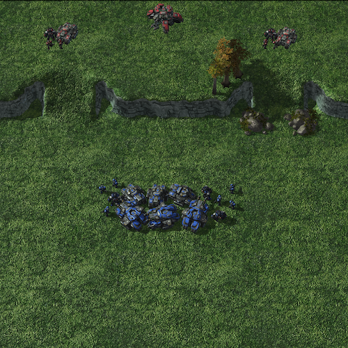
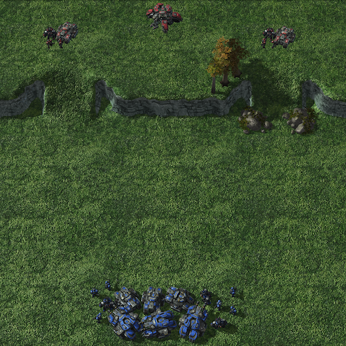
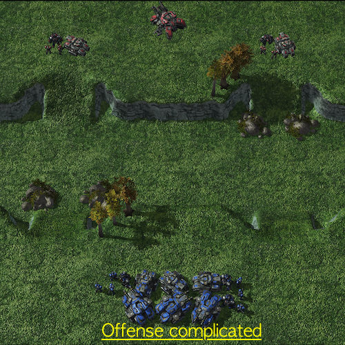
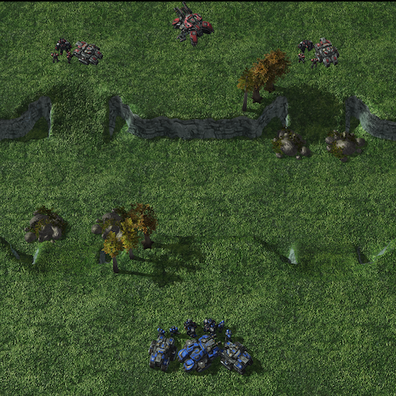
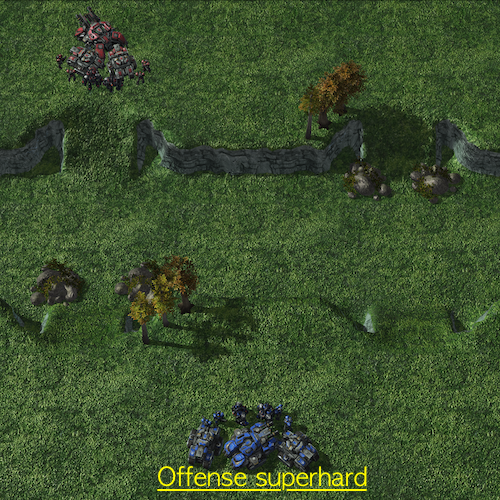

<div align="center">
    
# SMAC+
    
**Efficient Exploration Bechamrks for Learning of Multi-stage Tasks and Environmental Factors without Precise Reward Functions**

    
---
</div>


## 🧚 Authors & Links

**[The StarCraft Multi-Agent Challenges+ : Learning  of Multi-Stage Tasks and Environmental Factors without Precise Reward Functions](https://arxiv.org/abs/2207.02007)**
_Mingyu Kim*, Jihwan Oh*, Yongsik Lee, Joonkee Kim, Seonghwan Kim, Song Chong, Se-Young Yun. 
*:equal contribution

The detailed information are inllustrated in [[Paper](https://arxiv.org/abs/2207.02007)], 
[[Project Page](https://osilab-kaist.github.io/smac_plus/)] and [[Paperswithcode](https://paperswithcode.com/dataset/smac-plus)]

## ✍️ Notice
PyMARL is [WhiRL](http://whirl.cs.ox.ac.uk)'s framework for deep multi-agent reinforcement learning with PyTorch. Also, SMAC is [WhiRL](https://github.com/oxwhirl/smac)'s environment for research in the field of collaborative multi-agent reinforcement learning (MARL) based on Blizzard's StarCraft II RTS game. We work on based on these.
[SMAC+](https://github.com/osilab-kaist/smac_plus) provides its environment and exceutes training and testing RL algorithms based on PyMARL with both SMAC and SMAC+.

## 🆚 SMAC vs SMAC+ 
It contains 8 maps seperated to `defense`, `offense`, `challenging`. 

[SMAC](https://github.com/oxwhirl/smac) is the standard benchmark of Multi-Agent Reinforcement Learning. SMAC are mainly concerned with ensuring that all agents cooperatively eliminate approaching adversaries only through fine manipulation with obvious reward func
tions. 

[SMAC+](https://github.com/osilab-kaist/smac_plus) is interested in the exploration capability of MARL algorithms to efficiently learn implicit multi-stage tasks and environmental factors as well as micro-control.

|Main issues|SMAC|SMAC+|
|---|---|----|
|Agent's micro-control|O|O|
|Multi-stage tasks|interm|O|
|Environment factors||O|

## 🌏 Maps
SG, Mar and M refer each Siege Tank, Marauder, Marine units.
### **Defense**
<div align="center">






</div>

| Name | Ally Units | Enemy Units | Opponents approach |
|---|---|---|---|
| `defense_infantry` | 1 Mar & 4 M | 1 Mar & 6 M | One-sided |
| `defense_armored` | 1 SG Tank, 1 Tank, 1 Mar & 5 M | 2 Tank, 2 Mar & 9 M | Two-sided |
| `defense_outnumbered` | 1 SG Tank, 1 Tank, 1 Mar & 5 M  | 2 Tank, 3 Mar & 10 M | Two-sided |

### **Offense**
<div align="center">





</div>

| Name | Ally Units | Enemy Units | Distance & formation |
|---|---|---|---|
| `offense_near` |  3 SG Tank, 3 Tank, 3 Mar & 4 M| 1 SG Tank, 2 Tank, 2 Mar & 4 M | Near & Spread |
| `offense_distant` |  3 SG Tank, 3 Tank, 3 Mar & 4 M| 1 SG Tank, 2 Tank, 2 Mar & 4 M | Distant & Spread |
| `offense_complicated` |  3 SG Tank, 3 Tank, 3 Mar & 4 M| 1 SG Tank, 2 Tank, 2 Mar & 4 M | Complicated & Spread |

### **Challenging**
<div align="center">




</div>

| Name | Ally Units | Enemy Units | Distance & formation |
|---|---|---|---|
| `offense_hard` |  1 SG Tank, 2 Tank, 2 Mar & 4 M| 1 SG Tank, 2 Tank, 2 Mar & 4 M | Complicated & Spread |
| `offense_superhard` |  1 SG Tank, 2 Tank, 2 Mar & 4 M| 1 SG Tank, 2 Tank, 2 Mar & 4 M | Complicated & Gathered |

## 🎮 Implemented Algorithms
| Algorithm | Category | Paper Links|
|---|---|---|
| `IQL` | Value based | [paper](http://citeseerx.ist.psu.edu/viewdoc/summary?doi=10.1.1.55.8066)|
| `VDN` | Value based |  [paper](https://arxiv.org/abs/1706.05296)|
| `QTRAN` | Value based |  [paper](https://arxiv.org/abs/1905.05408)|
| `QMIX` | Value based |  [paper](https://arxiv.org/abs/1803.11485)|
| `DIQL` | Distributional Value based | [paper](https://arxiv.org/abs/2102.07936)|
| `DDN` | Distributional Value based | [paper](https://arxiv.org/abs/2102.07936)|
| `DMIX` | Distributional Value based | [paper](https://arxiv.org/abs/2102.07936) |
| `DRIMA` | Distributional Value based | [paper](https://openreview.net/forum?id=5qwA7LLbgP0) |
| `COMA` | Policy Gradient based | [paper](https://arxiv.org/abs/1705.08926) |
| `MASAC` | Policy Gradient based | [paper](https://arxiv.org/abs/1801.01290) |
| `MADDPG` | Policy Gradient based | [paper](https://arxiv.org/abs/1706.02275) |
## ⚙️ Installation instructions
```diff
- Please pay attention to the version of SC2 you are using for your experiments. 
- Performance is *not* always comparable between versions. 
- The results in SMAC (https://arxiv.org/abs/1902.04043) use SC2.4.6.2.69232 not SC2.4.10.
- wget http://blzdistsc2-a.akamaihd.net/Linux/SC2.4.6.2.69232.zip
```

**1️⃣ Cloning SMAC_PLUS:**
```shell
git clone https://github.com/osilab-kaist/smac_plus.git
```

**2️⃣ Download and set up StarCraft II:**
```shell
bash install_sc2.sh
```

This will download SC2 into the `pymarl/3rdparty` folder, or using symbolic link to use SC2.


**3️⃣ Install required packages**

The `requirements.txt` file can be used to install the necessary packages into a virtual environment (not recommended).

After install requirements, install `torch` suitable for the environment.

**4️⃣ Move map directoryes to StarCraftII map directory**

Move `SMAC_Maps` / `SMAC_Plus_Maps` directories to `StarCraftII/Maps/`

```shell
mv SMAC_Plus_Maps ./pymarl/3rdparty/StarCraftII/Maps/
mv SMAC_Maps ./pymarl/3rdparty/StarCraftII/Maps/
```
You should have a structure like these:
```
smac_plus
├── pymarl
│   ├── docker
│   ├── 3rdparty
│   │   └── StarCraftII 
│   │       ├── Maps
│   │       │   ├── SMAC_Maps
│   │       │   └── SMAC_Plus_Maps
│   │       └── ...
│   ├── src
│   └── results
├── smac_plus
├── requirements.txt
└── install_sc2.sh

```

## 🏃Run an experiment 
Episode experience buffer
```shell
cd ./pymarl
python src/main.py --alg=qmix --env-config=smac_plus with env_args.map_name=offense_hard
python src/main.py --alg=qmix --env-config=smac with env_args.map_name=2s3z
```

Parallel experience beffer
```shell
cd ./pymarl
python src/main.py --alg=qmix --env-config=smac_plus with env_args.map_name=offense_hard runner=parallel batch_size_run=20
python src/main.py --alg=qmix --env-config=smac with env_args.map_name=2s3z runner=parallel batch_size_run=20
```

The config files act as defaults for an algorithm or environment. 

They are all located in `src/config`.

`--config` refers to the config files in `src/config/algs`
`--env-config` refers to the config files in `src/config/envs`

All results will be stored in the `results` folder.

## 🤝 License

Code licensed under the Apache License v2.0

## 📌 Citation
```bibtext
@article{kim2022smacplus,
  title={The StarCraft Multi-Agent Challenges+ : Learning of Multi-Stage Tasks and Environmental Factors without Precise Reward Functions},
  author={Mingyu Kim, Jihwan Oh, Yongsik Lee, Joonkee Kim, Seonghwan Kim, Song Chong, Se-Young Yun},
  journal={arXiv preprint arXiv:2207.02007},
  year={2022}
}
```
<!-- ## Saving and loading learnt models

### Saving models

You can save the learnt models to disk by setting `save_model = True`, which is set to `False` by default. The frequency of saving models can be adjusted using `save_model_interval` configuration. Models will be saved in the result directory, under the folder called *models*. The directory corresponding each run will contain models saved throughout the experiment, each within a folder corresponding to the number of timesteps passed since starting the learning process.

### Loading models

Learnt models can be loaded using the `checkpoint_path` parameter, after which the learning will proceed from the corresponding timestep. 

## Watching StarCraft II replays

`save_replay` option allows saving replays of models which are loaded using `checkpoint_path`. Once the model is successfully loaded, `test_nepisode` number of episodes are run on the test mode and a .SC2Replay file is saved in the Replay directory of StarCraft II. Please make sure to use the episode runner if you wish to save a replay, i.e., `runner=episode`. The name of the saved replay file starts with the given `env_args.save_replay_prefix` (map_name if empty), followed by the current timestamp. 

The saved replays can be watched by double-clicking on them or using the following command:

```shell
python -m pysc2.bin.play --norender --rgb_minimap_size 0 --replay NAME.SC2Replay
```

**Note:** Replays cannot be watched using the Linux version of StarCraft II. Please use either the Mac or Windows version of the StarCraft II client.

## Documentation/Support

Documentation is a little sparse at the moment (but will improve!). Please raise an issue in this repo, or email [Tabish](mailto:tabish.rashid@cs.ox.ac.uk) -->

<!-- ## Citing PyMARL 

If you use PyMARL in your research, please cite the [SMAC Plus]().

*M. Samvelyan, T. Rashid, C. Schroeder de Witt, G. Farquhar, N. Nardelli, T.G.J. Rudner, C.-M. Hung, P.H.S. Torr, J. Foerster, S. Whiteson. The StarCraft Multi-Agent Challenge, CoRR abs/1902.04043, 2019.*

In BibTeX format:

```tex
@article{samvelyan19smac,
  title = {{The} {StarCraft} {Multi}-{Agent} {Challenge}},
  author = {Mikayel Samvelyan and Tabish Rashid and Christian Schroeder de Witt and Gregory Farquhar and Nantas Nardelli and Tim G. J. Rudner and Chia-Man Hung and Philiph H. S. Torr and Jakob Foerster and Shimon Whiteson},
  journal = {CoRR},
  volume = {abs/1902.04043},
  year = {2019},
}
```

## License

Code licensed under the Apache License v2.0 -->
